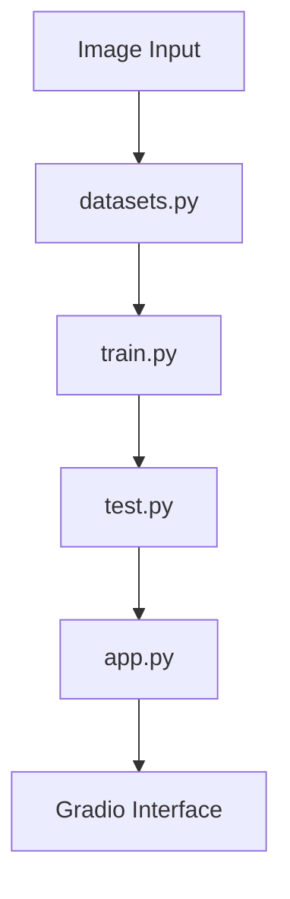

# 🤖 ResNet Implementation Drafts

<div align="center">

### **I made this for educational purposes, exploring ResNet architectures, custom training loops, and hands-on deep learning implementations of Image Classification.**


⭐ **Star this repo if it helps you!** ⭐

🔥 **Share it with the community!** 🔥

[](https://x.com/intent/tweet?text=Check%20out%20this%20amazing%20AI%20Image%20Classification%20project!%20🤖✨%20https://github.com/Mushrum-mmb/Simple-AI-Image-Classification%20%23AI%20%23MachineLearning%20%23DeepLearning)
[](https://www.facebook.com/sharer/sharer.php?u=https://github.com/Mushrum-mmb/Simple-AI-Image-Classification)
[](https://www.linkedin.com/sharing/share-offsite/?url=https://github.com/Mushrum-mmb/Simple-AI-Image-Classification)
[](https://www.reddit.com/submit?title=Amazing%20AI%20Image%20Classification%20Project&url=https://github.com/Mushrum-mmb/Simple-AI-Image-Classification)

</div>

---

## 📋 Table of Contents

- [About](#-about)
- [Features](#-features)
- [Gallery](#-gallery)
- [Local Usage](#%EF%B8%8F-local-usage)
- [Google Colab Usage](#-google-colab-usage)
- [How It Works](#-how-it-works)
- [Contributing](#-contributing)
- [License](#-license)


## 🚀 About

<div align="center">

**🤖 Cutting-edge AI image classification powered by ResNet-50!**

</div>

<div align="center">

| **Accuracy** | **Model** | **Framework** | **Author** |
|:---:|:---:|:---:|:---:|
| **92.5%** | ResNet-50 | Gradio | [Mushrum-mmb](https://github.com/Mushrum-mmb/) |

</div>

### 🌟 **Key Highlights:**
- **State-of-the-art accuracy** at 92.5%.
- **Real-time predictions** with confidence scores
- **Web-based interface** for easy access
- **Comment tutoring** support in code
- **Cross-platform compatibility**
---

## 📸 Gallery

<div align="center">
    
### 📊 **Current Model Performance**

**Note:** *This exceptional accuracy is calculated from validation datasets. Real-world performance may vary. *


*Confusion matrix*


<div align="center">


</div>


*Tensorboard quick view and comparison*


<div align="center">


   
</div>


*Examples of successful animal image classification*


</div>


</div>

---

## ✨ Features

<div align="center">

### **What Makes This Special?**

</div>

| Feature | Description | Benefit |
|---------|-------------|---------|
| **Image Classification** | Upload images for instant animal category prediction | Quick and accurate results |
| **Pre-trained Model** | ResNet-50 architecture fine-tuned on animal datasets | Superior accuracy and reliability |
| **Real-time Inference** | Instant predictions with confidence percentages | Immediate feedback for users |
| **GPU Acceleration** | Automatic GPU detection and utilization | Lightning-fast processing |
| **Easy Deployment** | One-command launch with public sharing option | Hassle-free setup and sharing |
| **Google Colab Ready** | Optimized for cloud-based training and testing | Perfect for low-spec devices |

<div align="center">

### 🎯 **Perfect For:**
**Students** • **Researchers** • **Developers** 

</div>

---

## ▶️ Local Usage

<div align="center">

### 🚀 **Launch Your AI in 3 Simple Steps!**

</div>

**Step 1:** Clone the repository
```bash
git clone https://github.com/Mushrum-mmb/ResNet-Implementation-Drafts.git
```

**Step 2:** Navigate to project directory
```bash
cd ResNet-Implementation-Drafts
```

**Step 3:** Install the requirements
```bash
pip install -r requirements.txt
```

**Step 4:** Launch the application
```bash
python app.py
```

<div align="center">
### 🎉 **Your AI is Ready!**
Open the provided link in your browser and start classifying images!

</div>


---

## 💻 Google Colab Usage

<div align="center">

### ☁️ **Perfect for Potato Computers!** 🥔

[](https://colab.research.google.com/drive/13yuj3zqh8ed1wi9KkUfnDeBKN0ZYgel1?usp=sharing)

</div>

Can't run AI on your device? No problem! Use our optimized Google Colab notebook for seamless cloud-based AI training and inference.

<details>
<summary>📖 <strong>Colab Guide (Click to expand)</strong></summary>

*Just execute the first and second cell*


**Launch and enjoy! 🎉**

</details>

---

## 🔧 How It Works

<div align="center">

### **Architecture Overview**

</div>

Our AI system consists of five core components working in harmony:

<div align="center">



</div>

| Component | Purpose | Key Features |
|-----------|---------|-------------|
| **datasets.py** | Data Management | • Custom PyTorch dataset class<br>• Image normalization and transforms<br>• Train/test data splitting |
| **train.py** | Model Training | • ResNet-50 architecture implementation<br>• TensorBoard logging integration<br>• Automatic checkpoint saving |
| **test.py** | Model Testing | • Single image inference<br>• Confidence score calculation<br>• Visual result display |
| **app.py** | Web Interface | • Gradio-powered UI<br>• Real-time predictions<br>• Public sharing capabilities |

---

## 🤝 Contributing

<div align="center">

### 💡 **Help Make This Project Even Better!**

[](https://github.com/Mushrum-mmb/Simple-AI-Image-Classification/issues)

</div>

We love contributions from the community! Here's how you can help:

- **Report bugs** or suggest features
- **Submit pull requests** with improvements
- **Improve documentation** and tutorials
- **Share your results** and use cases
- **Star the repo** to show support!

---

## 📜 License

<div align="center">

[](https://opensource.org/licenses/MIT)

This project is licensed under the **MIT License** - see the [LICENSE](LICENSE) file for details.

</div>
